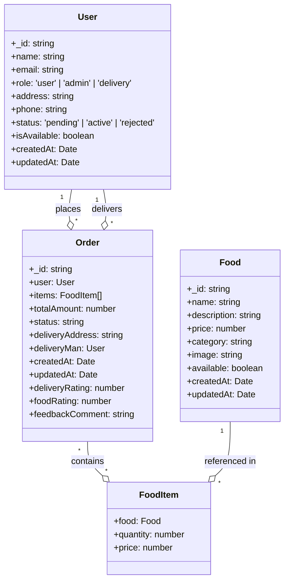
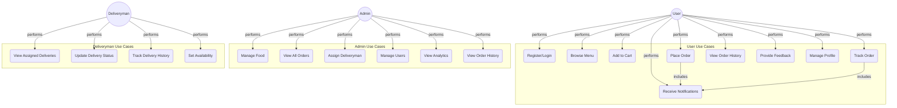

# Food Ordering App – Class Diagram, Use Cases, and Scenarios

## Class Diagram

---

## Use Case Diagram

---

## General Use Cases

- **User (Customer):**
  - Register, login, and manage profile
  - Browse menu and food details
  - Add items to cart and place orders
  - Track active orders and view order history
  - Provide feedback and ratings
  - Receive notifications

- **Admin:**
  - Manage food items (add, edit, delete)
  - View and manage all orders
  - Assign deliverymen to orders
  - Manage users and deliverymen
  - View analytics and feedback
  - Access order history with filters

- **Deliveryman:**
  - View assigned deliveries
  - Update delivery status
  - Track delivery history
  - Set availability

---

## Main Scenarios

### 1. User Places an Order
- User browses menu and adds food to cart
- User checks out, enters delivery address, and places order
- Order appears in "Active Orders" with status updates
- User receives notifications as order progresses
- After delivery, user can rate and leave feedback

### 2. Admin Manages Orders
- Admin logs in and accesses dashboard
- Admin views all orders (active, delivered, cancelled)
- Admin assigns deliveryman to an order
- Admin can filter order history by month
- Admin manages users and deliverymen

### 3. Deliveryman Delivers an Order
- Deliveryman logs in and sees assigned orders
- Updates status as order is picked up and delivered
- Marks order as delivered, which updates user and admin dashboards
- Can view delivery history and stats

---

This document summarizes the core data model, main use cases, and typical scenarios for the current state of the food ordering app. 