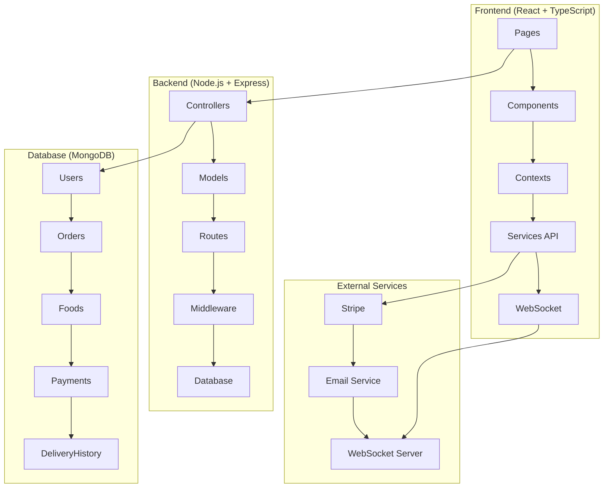

# 📚 Documentation Complète - OrderApp

## Vue d'ensemble

Cette documentation complète couvre tous les aspects de l'application OrderApp, une plateforme de livraison de nourriture avec gestion des commandes, des livreurs et des paiements.

## 📖 Documentation Disponible

### 1. 🚚 [Workflow de Livraison & Configuration Backend](DELIVERY_WORKFLOW_DOCUMENTATION.md)
- **Workflow de livraison complet** avec diagrammes d'états
- **Configuration backend** détaillée
- **API endpoints** et modèles de données
- **WebSocket events** pour les notifications temps réel
- **Déploiement** avec Docker et Kubernetes
- **Utilitaires de calcul** (distance, temps de livraison)

### 2. 🎨 [Architecture Frontend](FRONTEND_DOCUMENTATION.md)
- **Stack technologique** (React, TypeScript, Tailwind CSS)
- **Architecture des composants** et structure du projet
- **Contextes React** (Auth, Cart, Socket, Availability)
- **Services API** et types TypeScript
- **Pages et routage** avec protection des routes
- **Design system** et thème visuel
- **Tests et qualité** avec Vitest
- **Déploiement** et optimisations

## 🏗️ Architecture Générale



## 🚀 Démarrage Rapide

### Prérequis
- Node.js 18+
- MongoDB
- Docker (optionnel)

### Installation

1. **Backend**
```bash
cd backend
npm install
npm run dev
```

2. **Frontend**
```bash
cd frontend
npm install
npm run dev
```

3. **Avec Docker**
```bash
docker-compose up -d
```

## 🔑 Fonctionnalités Principales

### 👥 Gestion des Utilisateurs
- **Clients** : Inscription, commande, suivi
- **Livreurs** : Candidature, gestion des livraisons
- **Admin** : Gestion complète de la plateforme

### 🍕 Gestion des Commandes
- **Workflow complet** : Pending → Confirmed → Preparing → Ready → Out for Delivery → Delivered
- **Assignation automatique** des livreurs
- **Notifications temps réel** via WebSocket
- **Suivi GPS** des livraisons

### 💳 Système de Paiement
- **Stripe** pour les paiements par carte
- **Paiement en espèces** à la livraison
- **Gestion des remboursements**

### 📱 Interface Utilisateur
- **Design responsive** avec Tailwind CSS
- **Thème restaurant italien**
- **Composants réutilisables** (shadcn/ui)
- **Animations fluides**

## 🛠️ Technologies Utilisées

### Backend
- **Node.js** + Express.js
- **MongoDB** + Mongoose
- **Socket.io** pour WebSocket
- **JWT** pour l'authentification
- **Stripe** pour les paiements
- **Nodemailer** pour les emails

### Frontend
- **React 18** + TypeScript
- **Vite** comme build tool
- **Tailwind CSS** pour le styling
- **Radix UI** + shadcn/ui pour les composants
- **React Router** pour la navigation
- **TanStack Query** pour la gestion des données
- **React Hook Form** + Zod pour les formulaires

### DevOps
- **Docker** + Docker Compose
- **Kubernetes** pour le déploiement
- **Jenkins** pour CI/CD
- **SonarQube** pour l'analyse de qualité
- **Trivy** pour la sécurité

## 📊 Métriques et Monitoring

### Tests
- **Backend** : Jest + Supertest
- **Frontend** : Vitest + Testing Library
- **Couverture** : 80%+ de code coverage

### Qualité
- **ESLint** pour le linting
- **SonarQube** pour l'analyse statique
- **Trivy** pour la sécurité des images

### Performance
- **Health checks** intégrés
- **Logs structurés**
- **Métriques de performance**

## 🔒 Sécurité

### Authentification
- **JWT tokens** avec expiration
- **Validation des tokens** côté client et serveur
- **Protection des routes** par rôle

### Données
- **Validation stricte** des entrées
- **Sanitisation** des données
- **CORS** configuré

### Paiements
- **Stripe** pour la sécurité des paiements
- **Tokens** sécurisés
- **Validation** des montants

## 📈 Évolutivité

### Architecture
- **Microservices ready**
- **API RESTful** bien structurée
- **WebSocket** pour le temps réel
- **Base de données** scalable

### Déploiement
- **Kubernetes** avec auto-scaling
- **Docker** pour la portabilité
- **CI/CD** automatisé

## 🐛 Dépannage

### Problèmes Courants

1. **Erreur CORS**
   - Vérifier la configuration CORS dans `backend/server.js`
   - Ajouter l'URL frontend dans les origines autorisées

2. **Token expiré**
   - Vérifier la validité du token JWT
   - Rediriger vers la page de connexion

3. **WebSocket non connecté**
   - Vérifier la configuration Socket.io
   - Vérifier les rooms et les permissions

4. **Erreur de build**
   - Vérifier les dépendances Node.js
   - Nettoyer le cache npm/yarn

### Logs
- **Backend** : Logs dans la console
- **Frontend** : Console du navigateur
- **Docker** : `docker logs <container_name>`

## 📞 Support

### Documentation
- Consulter les fichiers de documentation détaillés
- Vérifier les commentaires dans le code
- Utiliser les types TypeScript pour l'auto-complétion

### Développement
- Suivre les conventions de code établies
- Ajouter des tests pour les nouvelles fonctionnalités
- Documenter les changements importants

---

*Documentation mise à jour le ${new Date().toLocaleDateString('fr-FR')} - Version 1.0.0*
