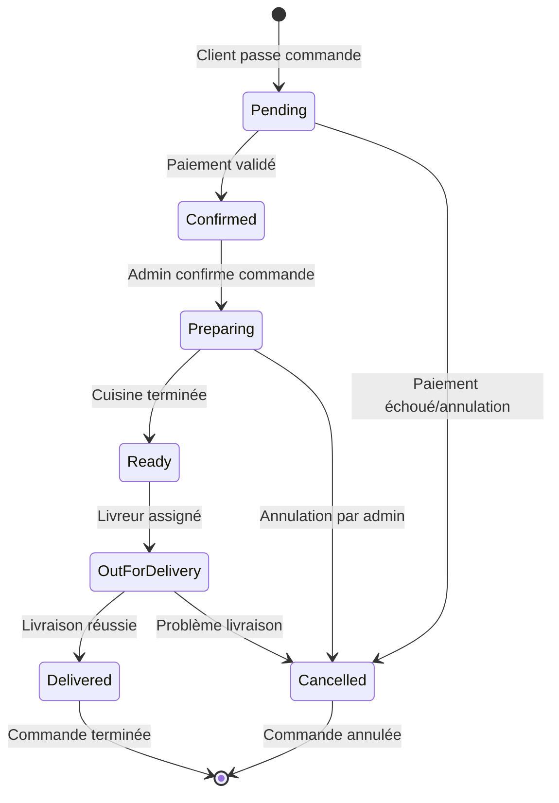

# 📦 Delivery Workflow & Backend Setup Documentation

## Table des matières
1. [Workflow de Livraison](#workflow-de-livraison)
2. [Configuration Backend](#configuration-backend)
3. [API Endpoints](#api-endpoints)
4. [Modèles de Données](#modèles-de-données)
5. [WebSocket Events](#websocket-events)
6. [Déploiement](#déploiement)

---

## 🚚 Workflow de Livraison

### 1. États des Commandes



### 2. Processus de Livraison Détaillé

#### Phase 1: Création de Commande
1. **Client passe commande** (`POST /api/orders`)
   - Validation des articles
   - Calcul du montant total
   - Enregistrement de la localisation client
   - Création de l'entité paiement

2. **Tentative d'assignation automatique**
   - Recherche des livreurs disponibles
   - Calcul de la distance (formule Haversine)
   - Assignation du livreur le plus proche
   - Estimation du temps de livraison

#### Phase 2: Gestion par l'Admin
1. **Confirmation de commande** (`PUT /api/orders/:id`)
   - Changement de statut: `pending` → `confirmed`
   - Notification WebSocket aux clients

2. **Préparation en cuisine** (`PUT /api/orders/:id`)
   - Changement de statut: `confirmed` → `preparing`
   - Calcul du temps de préparation

3. **Commande prête** (`PUT /api/orders/:id`)
   - Changement de statut: `preparing` → `ready`
   - Notification aux livreurs disponibles

#### Phase 3: Livraison
1. **Assignation manuelle** (si auto-assignation échouée)
   - Admin sélectionne un livreur disponible
   - Mise à jour de la commande avec le livreur

2. **Début de livraison** (`PUT /api/orders/:id`)
   - Changement de statut: `ready` → `out_for_delivery`
   - Notification au client et au livreur

3. **Livraison terminée** (`PUT /api/orders/:id`)
   - Changement de statut: `out_for_delivery` → `delivered`
   - Enregistrement de l'heure de livraison
   - Auto-confirmation des paiements en espèces

### 3. Système d'Assignation Automatique

#### Critères d'Assignation
- **Distance**: Calculée avec la formule Haversine
- **Disponibilité**: `isAvailable: true`
- **Statut**: `status: 'active'`
- **Localisation**: Position GPS actuelle requise

#### Algorithme de Sélection
```javascript
// 1. Filtrer les livreurs disponibles
const availableDeliveryPersons = await Users.find({
  role: 'delivery',
  status: 'active',
  isAvailable: true,
  currentLocation: { $exists: true, $ne: null }
});

// 2. Calculer les distances
const nearestAssignment = findNearestDeliveryPerson(
  availableDeliveryPersons,
  order.customerLocation.latitude,
  order.customerLocation.longitude
);

// 3. Assigner si trouvé
if (nearestAssignment) {
  await Orders.findByIdAndUpdate(orderId, {
    deliveryMan: nearestAssignment.deliveryPerson._id,
    estimatedDeliveryTime: nearestAssignment.timeEstimate.estimatedDeliveryTime,
    assignedAt: new Date()
  });
}
```

### 4. Gestion de la Disponibilité des Livreurs

#### Mise à jour de disponibilité
- **Endpoint**: `PUT /api/deliveryman/availability`
- **Validation**: Vérification des livraisons actives
- **Restriction**: Impossible de passer indisponible avec des livraisons en cours

#### États de disponibilité
- `isAvailable: true` - Accepte de nouvelles livraisons
- `isAvailable: false` - Indisponible pour nouvelles livraisons

---

## ⚙️ Configuration Backend

### 1. Structure du Projet

```
backend/
├── controllers/          # Logique métier
│   ├── orderController.js
│   ├── deliverymanController.js
│   └── deliveryHistoryController.js
├── models/              # Schémas MongoDB
│   ├── orderModel.js
│   ├── userModel.js
│   └── deliveryHistoryModel.js
├── routes/              # Définition des routes
│   ├── orderRoute.js
│   └── deliverymanRoute.js
├── utils/               # Utilitaires
│   ├── distanceCalculator.js
│   └── database.js
├── services/            # Services externes
│   └── socketService.js
└── server.js           # Point d'entrée
```

### 2. Dépendances Principales

```json
{
  "dependencies": {
    "express": "^4.18.1",           // Framework web
    "mongoose": "^6.3.4",           // ODM MongoDB
    "socket.io": "^4.8.1",          // WebSocket
    "bcryptjs": "^3.0.2",           // Hachage des mots de passe
    "jsonwebtoken": "^9.0.2",       // JWT
    "cors": "^2.8.5",               // CORS
    "multer": "^2.0.1",             // Upload de fichiers
    "nodemailer": "^7.0.3",         // Envoi d'emails
    "stripe": "^18.5.0"             // Paiements
  }
}
```

### 3. Configuration Serveur

#### Variables d'Environnement
```bash
# Base de données
DB=mongodb://localhost:27017/orderapp

# JWT
JWT_SECRET=your-super-secret-jwt-key-2024

# Serveur
PORT=5000
NODE_ENV=development

# Email (optionnel)
MAIL_HOST=smtp.gmail.com
MAIL_PORT=587
MAIL_USER=your-email@gmail.com
MAIL_PASSWORD=your-app-password
```

#### Configuration CORS
```javascript
app.use(cors({
  origin: function (origin, callback) {
    const allowedOrigins = [
      'http://localhost:5173',    // Vite dev server
      'http://localhost:3000',    // React dev server
      'http://192.168.100.96:3000' // Réseau local
    ];
    
    if (!origin || allowedOrigins.includes(origin)) {
      return callback(null, true);
    }
    callback(new Error('Not allowed by CORS'));
  },
  credentials: true,
  methods: ['GET', 'POST', 'PUT', 'DELETE', 'OPTIONS'],
  allowedHeaders: ['Content-Type', 'Authorization']
}));
```

### 4. Middleware d'Authentification

```javascript
// authMiddleware.js
const jwt = require('jsonwebtoken');

const authMiddleware = (req, res, next) => {
  const token = req.header('Authorization')?.replace('Bearer ', '');
  
  if (!token) {
    return res.status(401).json({ message: 'No token, authorization denied' });
  }

  try {
    const decoded = jwt.verify(token, process.env.JWT_SECRET);
    req.user = decoded;
    next();
  } catch (error) {
    res.status(401).json({ message: 'Token is not valid' });
  }
};
```

---

## 🔌 API Endpoints

### 1. Commandes (`/api/orders`)

| Méthode | Endpoint | Description | Auth |
|---------|----------|-------------|------|
| POST | `/api/orders` | Créer une commande | Client |
| GET | `/api/orders` | Lister toutes les commandes | Admin |
| GET | `/api/orders/user` | Commandes de l'utilisateur | Client |
| GET | `/api/orders/delivery` | Commandes de livraison | Livreur |
| PUT | `/api/orders/:id` | Mettre à jour le statut | Admin/Livreur |
| DELETE | `/api/orders/:id` | Supprimer une commande | Admin |

### 2. Livreurs (`/api/deliveryman`)

| Méthode | Endpoint | Description | Auth |
|---------|----------|-------------|------|
| POST | `/api/deliveryman/apply` | Postuler comme livreur | Public |
| GET | `/api/deliveryman/pending` | Applications en attente | Admin |
| PUT | `/api/deliveryman/:id/approve` | Approuver une candidature | Admin |
| PUT | `/api/deliveryman/:id/reject` | Rejeter une candidature | Admin |
| PUT | `/api/deliveryman/availability` | Mettre à jour disponibilité | Livreur |

### 3. Notifications (`/api/orders`)

| Méthode | Endpoint | Description | Auth |
|---------|----------|-------------|------|
| GET | `/api/orders/notifications` | Notifications client | Client |
| GET | `/api/orders/delivery/notifications` | Notifications livreur | Livreur |
| GET | `/api/orders/delivery/history` | Historique livraisons | Livreur |

---

## 📊 Modèles de Données

### 1. Modèle Commande (Order)

```javascript
const orderSchema = new mongoose.Schema({
  user: { type: ObjectId, ref: 'user', required: true },
  items: [{
    food: { type: ObjectId, ref: 'food', required: true },
    quantity: { type: Number, required: true, min: 1 },
    price: { type: Number, required: true }
  }],
  totalAmount: { type: Number, required: true },
  status: { 
    type: String, 
    enum: ['pending', 'confirmed', 'preparing', 'ready', 'out_for_delivery', 'delivered', 'cancelled'],
    default: 'pending' 
  },
  deliveryAddress: { type: String, required: true },
  customerLocation: {
    latitude: { type: Number, required: true },
    longitude: { type: Number, required: true },
    accuracy: { type: Number, default: 10 },
    timestamp: { type: Date, default: Date.now }
  },
  deliveryMan: { type: ObjectId, ref: 'user' },
  estimatedDeliveryTime: { type: Date },
  actualDeliveryTime: { type: Date },
  deliveryNotes: { type: String },
  deliveryRating: { type: Number, min: 1, max: 5 },
  foodRating: { type: Number, min: 1, max: 5 },
  feedbackComment: { type: String },
  assignedAt: { type: Date },
  cancelledAt: { type: Date },
  payment: { type: ObjectId, ref: 'payment' }
}, { timestamps: true });
```

### 2. Modèle Utilisateur (User)

```javascript
const userSchema = new mongoose.Schema({
  name: { type: String, required: true },
  email: { type: String, required: true, unique: true },
  password: { type: String, required: true },
  phone: { type: String },
  role: { 
    type: String, 
    enum: ['admin', 'customer', 'delivery'], 
    default: 'customer' 
  },
  status: { 
    type: String, 
    enum: ['active', 'pending', 'rejected'], 
    default: 'active' 
  },
  isAvailable: { type: Boolean, default: false },
  vehicleType: { type: String },
  currentLocation: {
    type: { type: String, enum: ['Point'], default: 'Point' },
    coordinates: { type: [Number], default: [0, 0] }
  },
  vehiclePhoto: { type: String },
  facePhoto: { type: String },
  cinPhoto: { type: String }
}, { timestamps: true });
```

### 3. Modèle Historique de Livraison

```javascript
const deliveryHistorySchema = new mongoose.Schema({
  deliveryManId: { type: ObjectId, ref: 'user', required: true },
  orderId: { type: ObjectId, ref: 'order', required: true },
  customerId: { type: ObjectId, ref: 'user', required: true },
  pickupLocation: {
    latitude: { type: Number, required: true },
    longitude: { type: Number, required: true },
    address: { type: String },
    timestamp: { type: Date, default: Date.now }
  },
  deliveryLocation: {
    latitude: { type: Number, required: true },
    longitude: { type: Number, required: true },
    address: { type: String, required: true },
    timestamp: { type: Date, default: Date.now }
  },
  routePoints: [{
    latitude: { type: Number, required: true },
    longitude: { type: Number, required: true },
    timestamp: { type: Date, default: Date.now },
    accuracy: { type: Number },
    speed: { type: Number },
    heading: { type: Number }
  }],
  totalDistance: { type: Number, default: 0 },
  totalTime: { type: Number, default: 0 },
  averageSpeed: { type: Number, default: 0 },
  statusHistory: [{
    status: { 
      type: String, 
      enum: ['assigned', 'picked_up', 'in_transit', 'delivered', 'failed'],
      required: true 
    },
    timestamp: { type: Date, default: Date.now },
    location: {
      latitude: { type: Number },
      longitude: { type: Number }
    },
    notes: { type: String }
  }],
  deliveryRating: { type: Number, min: 1, max: 5 },
  deliveryNotes: { type: String }
}, { timestamps: true });
```

---

## 🔔 WebSocket Events

### 1. Événements Émis par le Serveur

#### Nouvelles Commandes
```javascript
// Notification admin
io.to('admin').emit('new-order', {
  type: 'new-order',
  order: orderObject,
  message: `New order #${orderId} received from ${customerName}`
});

// Notification livreurs
io.to('delivery').emit('new-order', {
  type: 'new-order',
  order: orderObject,
  message: `New order #${orderId} available for delivery`
});
```

#### Mise à Jour de Statut
```javascript
// Notification client
io.to(`user-${userId}`).emit('order-updated', {
  type: 'order-update',
  order: updatedOrder,
  message: `Your order #${orderId} status updated to ${status}`
});

// Notification livreur
io.to(`delivery-${deliveryManId}`).emit('order-updated', {
  type: 'order-update',
  order: updatedOrder,
  message: `Order #${orderId} status updated to ${status}`
});
```

#### Assignation de Livraison
```javascript
io.to(`delivery-${deliveryManId}`).emit('delivery-assigned', {
  type: 'delivery-assigned',
  order: orderObject,
  distance: distanceInMeters,
  timeEstimate: formattedTimeEstimate,
  message: `You have been assigned to deliver order #${orderId}`
});
```

### 2. Événements Reçus par le Serveur

#### Connexion des Utilisateurs
```javascript
socket.on('join-room', (room) => {
  socket.join(room); // 'admin', 'delivery', 'user-{userId}'
});

socket.on('leave-room', (room) => {
  socket.leave(room);
});
```

---

## 🚀 Déploiement

### 1. Configuration Docker

#### Dockerfile Backend
```dockerfile
FROM node:18-alpine

WORKDIR /app

COPY package*.json ./
RUN npm ci --only=production

COPY . .

EXPOSE 5000

CMD ["npm", "start"]
```

#### Docker Compose
```yaml
services:
  backend:
    build: ./backend
    container_name: orderapp-backend
    restart: unless-stopped
    ports:
      - "5000:5000"
    environment:
      - NODE_ENV=production
      - DB=mongodb://mongo:27017/orderapp
      - JWT_SECRET=your-super-secret-jwt-key-2024
      - PORT=5000
    depends_on:
      - mongo
    networks:
      - orderapp-network
```

### 2. Configuration Kubernetes

#### Backend Deployment
```yaml
apiVersion: apps/v1
kind: Deployment
metadata:
  name: nodejs-backend
spec:
  replicas: 2
  selector:
    matchLabels:
      app: nodejs-backend
  template:
    metadata:
      labels:
        app: nodejs-backend
    spec:
      containers:
      - name: nodejs-backend
        image: firas444/pfe-backend:latest
        ports:
        - containerPort: 5000
        env:
        - name: NODE_ENV
          value: "production"
        - name: DB
          value: "mongodb://mongodb-service:27017/orderapp"
```

### 3. Pipeline CI/CD (Jenkins)

#### Étapes du Pipeline
1. **Checkout** - Récupération du code
2. **SonarQube Analysis** - Analyse de qualité
3. **Environment Check** - Vérification des prérequis
4. **Docker Login** - Authentification Docker Hub
5. **Backend Test** - Tests unitaires et d'intégration
6. **Frontend Test** - Tests du frontend
7. **Dependency Audit** - Audit de sécurité
8. **Build Images** - Construction des images Docker
9. **Scan Images** - Scan de sécurité avec Trivy
10. **Push Images** - Push vers Docker Hub
11. **Deploy to Kubernetes** - Déploiement sur K8s

### 4. Monitoring et Logs

#### Health Check
```javascript
// health-check.js
const mongoose = require('mongoose');

const healthCheck = async () => {
  try {
    // Test database connection
    await mongoose.connection.db.admin().ping();
    
    return {
      status: 'healthy',
      timestamp: new Date().toISOString(),
      uptime: process.uptime(),
      database: 'connected',
      memory: process.memoryUsage()
    };
  } catch (error) {
    return {
      status: 'unhealthy',
      timestamp: new Date().toISOString(),
      error: error.message
    };
  }
};
```

#### Logging
```javascript
// Middleware de logging
app.use((req, res, next) => {
  console.log(`${new Date().toISOString()} - ${req.method} ${req.path}`);
  next();
});
```

---

## 🔧 Utilitaires de Calcul

### 1. Calcul de Distance (Haversine)
```javascript
const calculateDistance = (lat1, lon1, lat2, lon2) => {
  const R = 6371e3; // Rayon de la Terre en mètres
  const φ1 = lat1 * Math.PI / 180;
  const φ2 = lat2 * Math.PI / 180;
  const Δφ = (lat2 - lat1) * Math.PI / 180;
  const Δλ = (lon2 - lon1) * Math.PI / 180;

  const a = Math.sin(Δφ/2) * Math.sin(Δφ/2) +
          Math.cos(φ1) * Math.cos(φ2) *
          Math.sin(Δλ/2) * Math.sin(Δλ/2);
  const c = 2 * Math.atan2(Math.sqrt(a), Math.sqrt(1-a));

  return R * c; // Distance en mètres
};
```

### 2. Estimation du Temps de Livraison
```javascript
const estimateDeliveryTime = (distance, averageSpeed = 25, preparationTime = 15) => {
  const distanceKm = distance / 1000;
  const travelTimeMinutes = (distanceKm / averageSpeed) * 60;
  const totalTimeMinutes = Math.ceil((travelTimeMinutes + preparationTime) * 1.1);
  
  const estimatedDeliveryTime = new Date();
  estimatedDeliveryTime.setMinutes(estimatedDeliveryTime.getMinutes() + totalTimeMinutes);
  
  return {
    distance: Math.round(distance),
    distanceKm: Math.round(distanceKm * 100) / 100,
    travelTimeMinutes: Math.round(travelTimeMinutes),
    preparationTimeMinutes: preparationTime,
    totalTimeMinutes: totalTimeMinutes,
    estimatedDeliveryTime: estimatedDeliveryTime,
    averageSpeed: averageSpeed
  };
};
```

---

## 📝 Notes Importantes

### 1. Sécurité
- Tous les endpoints nécessitent une authentification JWT
- Validation stricte des données d'entrée
- Gestion des erreurs sans exposition d'informations sensibles
- CORS configuré pour les domaines autorisés uniquement

### 2. Performance
- Index MongoDB sur les champs fréquemment utilisés
- Pagination pour les listes de commandes
- Cache des calculs de distance
- Optimisation des requêtes avec populate()

### 3. Scalabilité
- Architecture microservices ready
- WebSocket pour les notifications temps réel
- Base de données MongoDB scalable
- Déploiement Kubernetes avec auto-scaling

### 4. Monitoring
- Health checks intégrés
- Logs structurés
- Métriques de performance
- Alertes automatiques

---

*Documentation générée le ${new Date().toLocaleDateString('fr-FR')}*
