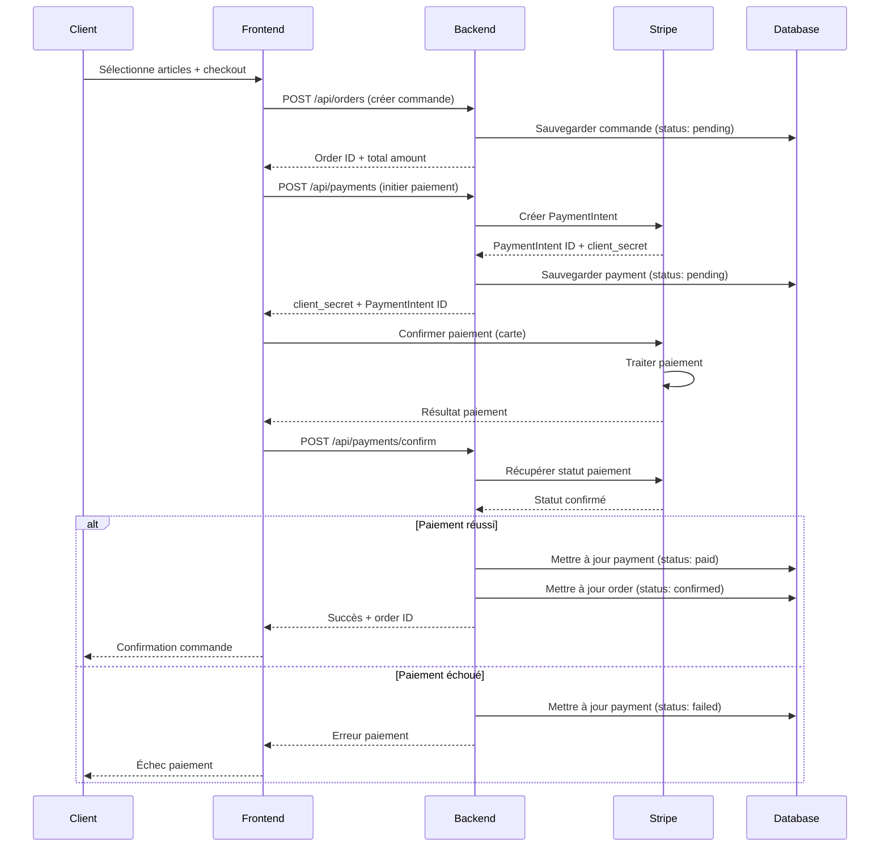
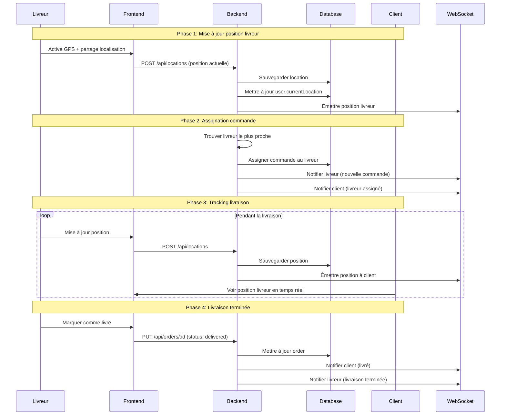
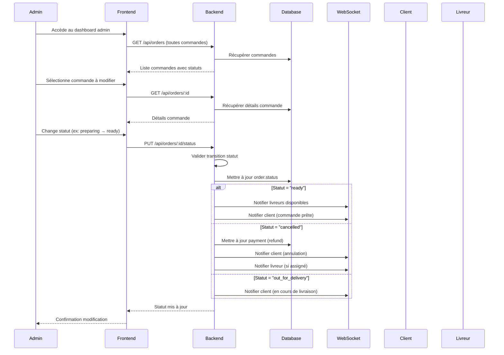
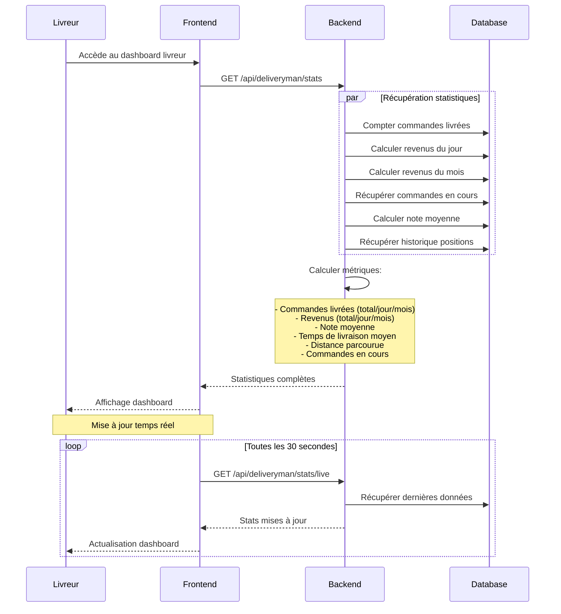
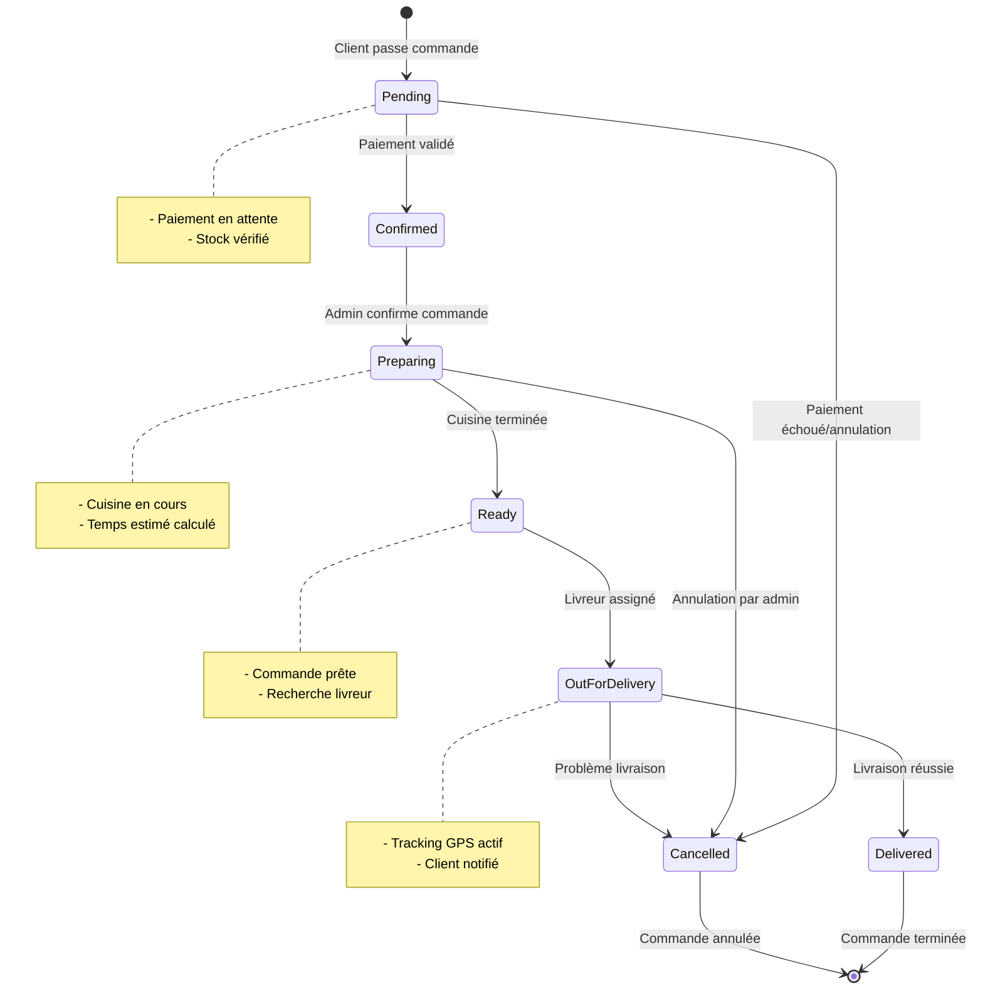
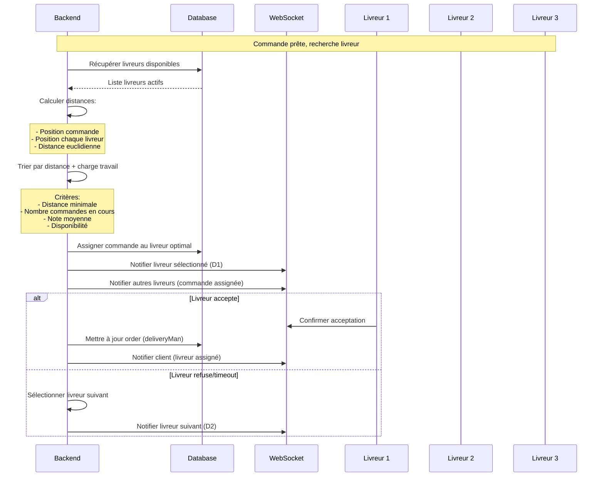
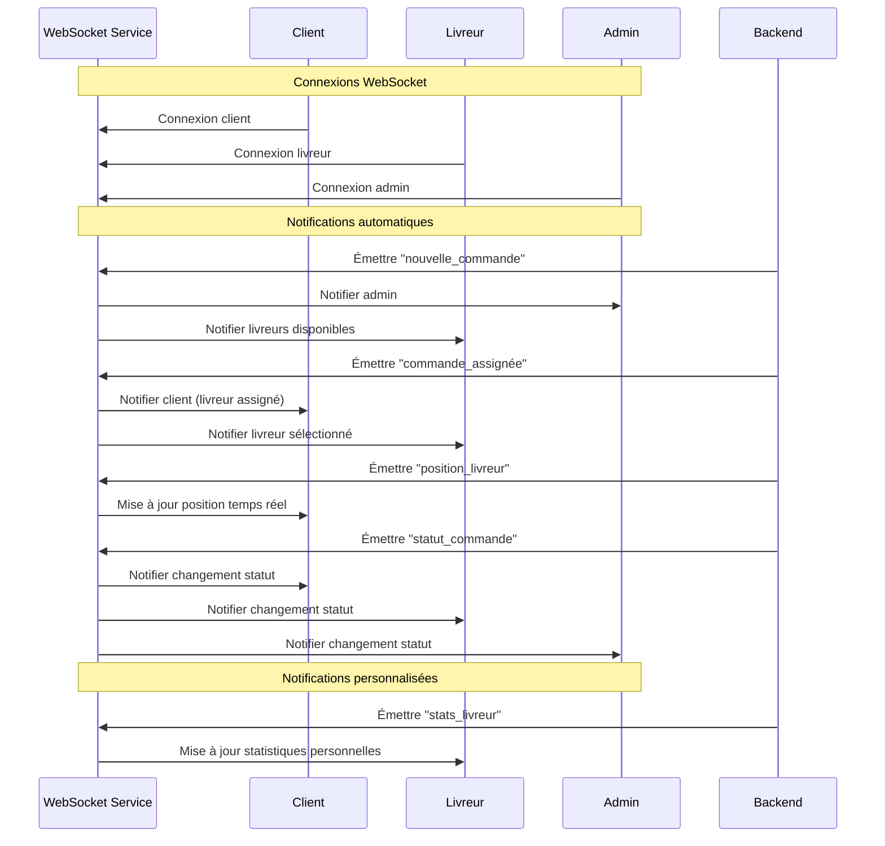

# Diagrammes de Scénarios - OrderApp

## 1. Scénario de Paiement (Payment Flow)

## 2. Scénario de Localisation et Tracking (Location Tracking)

## 3. Scénario de Modification de Statut Commande par Admin

## 4. Scénario de Statistiques Personnelles Livreur

## 5. Scénario de Gestion des Commandes (Workflow Complet)

## 6. Scénario de Recherche et Assignation Livreur

## 7. Scénario de Notifications Temps Réel

## Résumé des Scénarios Clés

### 🔄 **Flux de Paiement**
- Intégration Stripe complète
- Gestion des échecs de paiement
- Mise à jour automatique des statuts

### 📍 **Tracking de Localisation**
- Mise à jour GPS temps réel
- Optimisation assignation livreur
- Notifications position client

### ⚙️ **Gestion Admin**
- Modification statuts commandes
- Notifications automatiques
- Gestion des annulations

### 📊 **Dashboard Livreur**
- Statistiques personnelles
- Revenus et performance
- Mise à jour temps réel

### 🔄 **Workflow Complet**
- États de commande clairs
- Transitions validées
- Gestion des erreurs

### 🚚 **Assignation Intelligente**
- Algorithme de sélection optimal
- Critères multiples (distance, charge, performance)
- Fallback automatique

### 📱 **Notifications Temps Réel**
- WebSocket pour toutes les parties
- Notifications contextuelles
- Mise à jour automatique des interfaces
